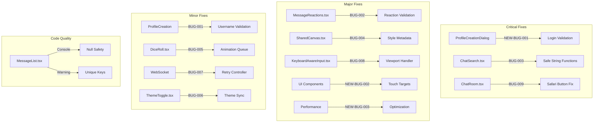

# Design Document: ChatUs Bug Fixes

## Overview

Данный документ описывает архитектуру и технические решения для исправления 16 багов, выявленных в ходе тестирования ChatUs. Исправления сгруппированы по компонентам и приоритету. Основной фокус — критические баги (недоступная кнопка входа, краш при кириллице, неактивная кнопка в Safari), затем серьёзные проблемы UX и производительности.

## Architecture

### Затрагиваемые компоненты



## Components and Interfaces

### 1. SafeStringUtils (BUG-003)

```typescript
// src/lib/safe-string.ts
export interface SafeStringResult {
  isValid: boolean;
  sanitized: string;
  error?: string;
}

export function sanitizeCyrillicInput(input: string): SafeStringResult;
export function escapeRegexSafe(str: string): string;
export function normalizeUnicode(str: string): string;
```

### 2. ReactionValidator (BUG-002)

```typescript
// src/lib/reaction-validator.ts
export interface ReactionContext {
  messageId: string;
  messageOwnerId: string;
  currentUserId: string;
  action: 'add' | 'remove';
}

export function canAddReaction(context: ReactionContext): boolean;
export function validateDoubleClick(context: ReactionContext): boolean;
```

### 3. CanvasStyleSerializer (BUG-004)

```typescript
// src/lib/canvas-style.ts
export interface CanvasStyleMetadata {
  brushType: BrushType;
  strokeWidth: number;
  color: string;
  timestamp: number;
}

export function serializeStyle(style: CanvasStyleMetadata): string;
export function deserializeStyle(data: string): CanvasStyleMetadata;
export function applyStyleToContext(ctx: CanvasRenderingContext2D, style: CanvasStyleMetadata): void;
```

### 4. ViewportManager (BUG-008)

```typescript
// src/lib/viewport-manager.ts
export interface ViewportState {
  originalHeight: number;
  currentHeight: number;
  keyboardHeight: number;
  isKeyboardVisible: boolean;
}

export function calculateViewportAdjustment(state: ViewportState): number;
export function scrollInputIntoView(element: HTMLElement, keyboardHeight: number): void;
export function restoreViewport(state: ViewportState): void;
```

### 5. UsernameValidator (BUG-001)

```typescript
// src/lib/username-validator.ts
export interface ValidationResult {
  isValid: boolean;
  message?: string;
  remainingChars: number;
}

export const MAX_USERNAME_LENGTH = 20;
export function validateUsername(username: string): ValidationResult;
export function getRemainingChars(username: string): number;
```

### 6. AnimationQueue (BUG-005)

```typescript
// src/lib/animation-queue.ts
export interface AnimationTask {
  id: string;
  duration: number;
  onComplete: () => void;
  onError?: (error: Error) => void;
}

export class AnimationQueue {
  enqueue(task: AnimationTask): void;
  cancel(id: string): void;
  clear(): void;
}
```

### 7. WebSocketRetryController (BUG-007)

```typescript
// src/lib/websocket-retry.ts
export interface RetryConfig {
  maxRetries: number;
  baseDelay: number;
  maxDelay: number;
}

export class WebSocketRetryController {
  constructor(config: RetryConfig);
  connect(url: string): Promise<WebSocket>;
  getRetryCount(): number;
  reset(): void;
}
```

### 8. ThemeSyncManager (BUG-006)

```typescript
// src/lib/theme-sync.ts
export interface ThemeState {
  isDark: boolean;
  togglePosition: boolean;
  source: 'storage' | 'user' | 'system';
}

export function syncThemeState(state: ThemeState): void;
export function loadThemeFromStorage(): ThemeState;
export function saveThemeToStorage(state: ThemeState): void;
```

### 9. LoginButtonValidator (NEW BUG-001) — CRITICAL

```typescript
// src/lib/login-validator.ts
export interface LoginValidationResult {
  isValid: boolean;
  canSubmit: boolean;
  errorMessage?: string;
}

export const MIN_USERNAME_LENGTH = 2;

export function validateLoginInput(username: string): LoginValidationResult;
export function shouldEnableLoginButton(username: string): boolean;
export function handleLoginValidationError(error: Error): void;
```

### 10. TouchTargetEnhancer (NEW BUG-002)

```typescript
// src/lib/touch-targets.ts
export const MIN_TOUCH_TARGET_SIZE = 44; // pixels

export interface TouchTargetConfig {
  minWidth: number;
  minHeight: number;
  padding: number;
}

export function calculateTouchPadding(currentSize: { width: number; height: number }): TouchTargetConfig;
export function isMobileViewport(): boolean;
```

### 11. PerformanceOptimizer (NEW BUG-003)

```typescript
// src/lib/performance-optimizer.ts
export interface PerformanceMetrics {
  loadTime: number;
  bundleSize: number;
  firstContentfulPaint: number;
}

export const TARGET_LOAD_TIME = 5000; // ms

export function measurePageLoad(): PerformanceMetrics;
export function shouldLazyLoad(componentName: string): boolean;
export function getOptimizedImageFormat(originalFormat: string): string;
```

## Data Models

### Message with Safe Keys

```typescript
interface SafeMessage extends Message {
  _reactKey: string; // Guaranteed unique key
}

function ensureMessageKey(message: Message): SafeMessage {
  return {
    ...message,
    _reactKey: message.id || `msg_${Date.now()}_${Math.random().toString(36).substr(2, 9)}`
  };
}
```

### Canvas Path with Style Metadata

```typescript
interface EnhancedCanvasPath extends CanvasPath {
  styleMetadata: CanvasStyleMetadata;
}
```

## Correctness Properties

*A property is a characteristic or behavior that should hold true across all valid executions of a system-essentially, a formal statement about what the system should do. Properties serve as the bridge between human-readable specifications and machine-verifiable correctness guarantees.*

### Property 1: Cyrillic Input Safety
*For any* string containing Cyrillic characters, the search function SHALL process the input without throwing exceptions and return a valid result (empty array or matching messages).
**Validates: Requirements 1.1, 1.2**

### Property 2: Reaction Ownership Validation
*For any* message and user combination, a double-click reaction SHALL be added if and only if the message belongs to the current user.
**Validates: Requirements 3.1, 3.2**

### Property 3: Canvas Style Round-Trip
*For any* valid brush style selection, serializing the style to chat and deserializing it back SHALL produce an equivalent style configuration.
**Validates: Requirements 4.1, 4.2, 4.3**

### Property 4: Viewport Adjustment Round-Trip
*For any* keyboard show/hide cycle, the viewport SHALL return to its original state after the keyboard closes.
**Validates: Requirements 5.1, 5.2, 5.3**

### Property 5: Username Length Validation
*For any* string longer than 20 characters, the validation function SHALL return isValid=false and display a warning.
**Validates: Requirements 6.1, 6.2**

### Property 6: Character Counter Accuracy
*For any* username input of length N, the remaining character counter SHALL display exactly (20 - N).
**Validates: Requirements 6.3**

### Property 7: Animation Timing Guarantee
*For any* dice roll animation, the animation SHALL complete within 2000ms regardless of system load.
**Validates: Requirements 7.1**

### Property 8: WebSocket Retry Exponential Backoff
*For any* sequence of connection failures, retry delays SHALL follow exponential backoff pattern with maximum 3 attempts.
**Validates: Requirements 8.2**

### Property 9: Theme State Synchronization
*For any* theme toggle action, the visual toggle state SHALL match the actual theme state both before and after page reload.
**Validates: Requirements 9.1, 9.2, 9.3**

### Property 10: Null-Safe Message Handling
*For any* message array (including undefined or null), the rendering function SHALL not throw and SHALL produce valid output.
**Validates: Requirements 10.1, 10.2, 10.3**

### Property 11: Unique Key Generation
*For any* list of messages, all generated React keys SHALL be unique within the list.
**Validates: Requirements 11.1, 11.2, 11.3**

### Property 12: ARIA Label Completeness
*For any* interactive element (button, input, link), the element SHALL have a non-empty aria-label or accessible name.
**Validates: Requirements 12.1**

### Property 13: Image Alt Attribute Presence

*For any* rendered image element, the element SHALL have a non-empty alt attribute.
**Validates: Requirements 13.3**

### Property 14: Login Button State Validation

*For any* username input of length >= 2 characters, the login button SHALL be enabled; for length < 2, it SHALL be disabled.
**Validates: Requirements 14.1, 14.2**

### Property 15: Touch Target Minimum Size

*For any* interactive element on mobile viewport (width < 768px), the element SHALL have minimum dimensions of 44x44 pixels.
**Validates: Requirements 15.1, 15.2, 15.3**

### Property 16: Page Load Time

*For any* page load, the initial render SHALL complete within 5000ms under normal network conditions.
**Validates: Requirements 16.1**

## Error Handling

### Search Error Handling (BUG-003)

```typescript
try {
  const sanitized = sanitizeCyrillicInput(query);
  if (!sanitized.isValid) {
    return { results: [], error: sanitized.error };
  }
  // Proceed with search
} catch (error) {
  logger.error('Search failed', error);
  return { results: [], error: 'Ошибка поиска. Попробуйте другой запрос.' };
}
```

### Safari Button Fallback (BUG-009)

```typescript
function handleCreateRoom() {
  // Check for Safari-specific issues
  if (isSafari() && !isButtonEnabled) {
    // Force enable via state update
    setIsButtonEnabled(true);
    // Use setTimeout as Safari workaround
    setTimeout(() => initiateRoomCreation(), 0);
    return;
  }
  initiateRoomCreation();
}
```

### Animation Error Recovery (BUG-005)

```typescript
animationQueue.enqueue({
  id: 'dice-roll',
  duration: 800,
  onComplete: () => setResult(finalValue),
  onError: (error) => {
    logger.warn('Animation failed, showing result directly', error);
    setResult(finalValue);
    setIsRolling(false);
  }
});
```

### Login Button Validation (NEW BUG-001)

```typescript
function handleUsernameChange(value: string) {
  const trimmed = value.trim();
  const isValid = trimmed.length >= MIN_USERNAME_LENGTH;

  // Immediate state update for button
  setIsButtonEnabled(isValid);
  setUsername(value);

  // Fallback validation on error
  try {
    validateLoginInput(trimmed);
  } catch (error) {
    logger.error('Login validation failed', error);
    // Force re-validation
    setIsButtonEnabled(trimmed.length >= 2);
  }
}
```

### Touch Target CSS (NEW BUG-002)

```css
/* src/app/globals.css */
@media (max-width: 767px) {
  .touch-target {
    min-width: 44px;
    min-height: 44px;
    padding: 8px;
  }

  button,
  [role="button"],
  a,
  input[type="submit"] {
    min-height: 44px;
    min-width: 44px;
  }
}
```

### Performance Optimization (NEW BUG-003)

```typescript
// next.config.js additions
const nextConfig = {
  experimental: {
    optimizeCss: true,
  },
  images: {
    formats: ['image/avif', 'image/webp'],
  },
  // Code splitting
  webpack: (config) => {
    config.optimization.splitChunks = {
      chunks: 'all',
      maxSize: 200000,
    };
    return config;
  },
};
```

## Testing Strategy

### Property-Based Testing Library
Используем **fast-check** для property-based тестирования в TypeScript/JavaScript.

### Unit Tests

1. **SafeStringUtils**: Тесты для кириллицы, смешанных строк, спецсимволов
2. **ReactionValidator**: Тесты для own/other messages, edge cases
3. **UsernameValidator**: Тесты для граничных значений (19, 20, 21 символ)
4. **AnimationQueue**: Тесты для очереди, отмены, таймаутов

### Property-Based Tests

Каждое свойство из раздела Correctness Properties будет реализовано как property-based тест с использованием fast-check:

```typescript
// Пример структуры теста
import * as fc from 'fast-check';

describe('Property 1: Cyrillic Input Safety', () => {
  it('should handle any Cyrillic string without crashing', () => {
    fc.assert(
      fc.property(
        fc.string().filter(s => /[а-яА-ЯёЁ]/.test(s)),
        (cyrillicString) => {
          const result = sanitizeCyrillicInput(cyrillicString);
          return result.isValid !== undefined;
        }
      ),
      { numRuns: 100 }
    );
  });
});
```

### Integration Tests

1. **Safari Button**: E2E тест в Safari WebDriver
2. **Keyboard Viewport**: Mobile emulation тест
3. **Theme Persistence**: LocalStorage + reload тест

### Test Configuration

- Минимум 100 итераций для каждого property-based теста
- Каждый тест аннотирован ссылкой на свойство: `**Feature: chatus-bug-fixes, Property N: description**`
